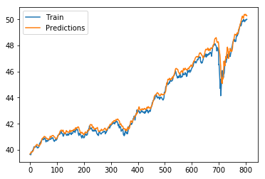

## Stock Prediction using Machine Learning
This predictor is implemented by training multiple architectures such DNN, LSTM, and GAN.
Among all DNNs are efficient and accurate. nth day stock is predicted based on previous m data point. i.e, 
```math
S_n = \textbf{E}\(S_n | S_{n-1}, S_{n-2}, . . , S_{n-m}\)
```
The below is the architectural flow of Deep Neural Network\
\
The below is the predicted data for a particular stock\

